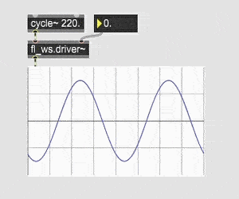
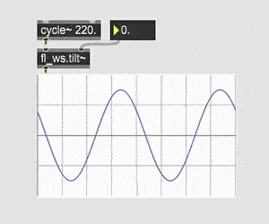
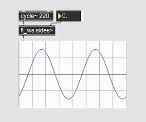
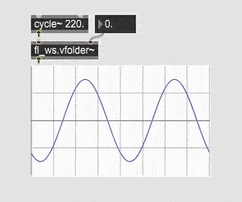
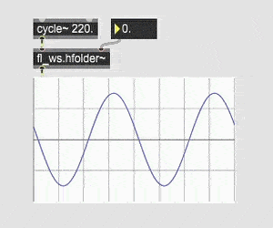
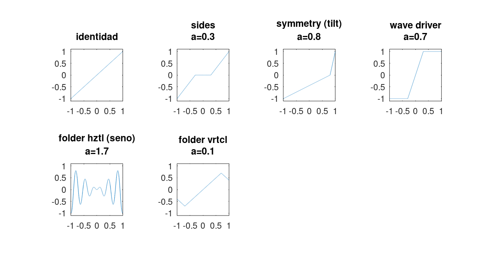

# About

Five externals for Windows version of Max 8 (Max/MSP) that produces different kinds of waveshaping. All of them receives audio as signal input and a parameter, that modulates the effect, as either float or signal.

### Driver

### Tilt

### Sides

### Vertical Folder

### Horizontal Folder

Here are the transfer functions:

This project contains, in addition, the prebuilt externals in .mxe64 format and a help file for each one.

------------------------------------------------------

# Versions History

**v0.1**
- At first all different types of waveshaping were combined in one single external called fl_waveshaping\~, it was a mess and not very useful
